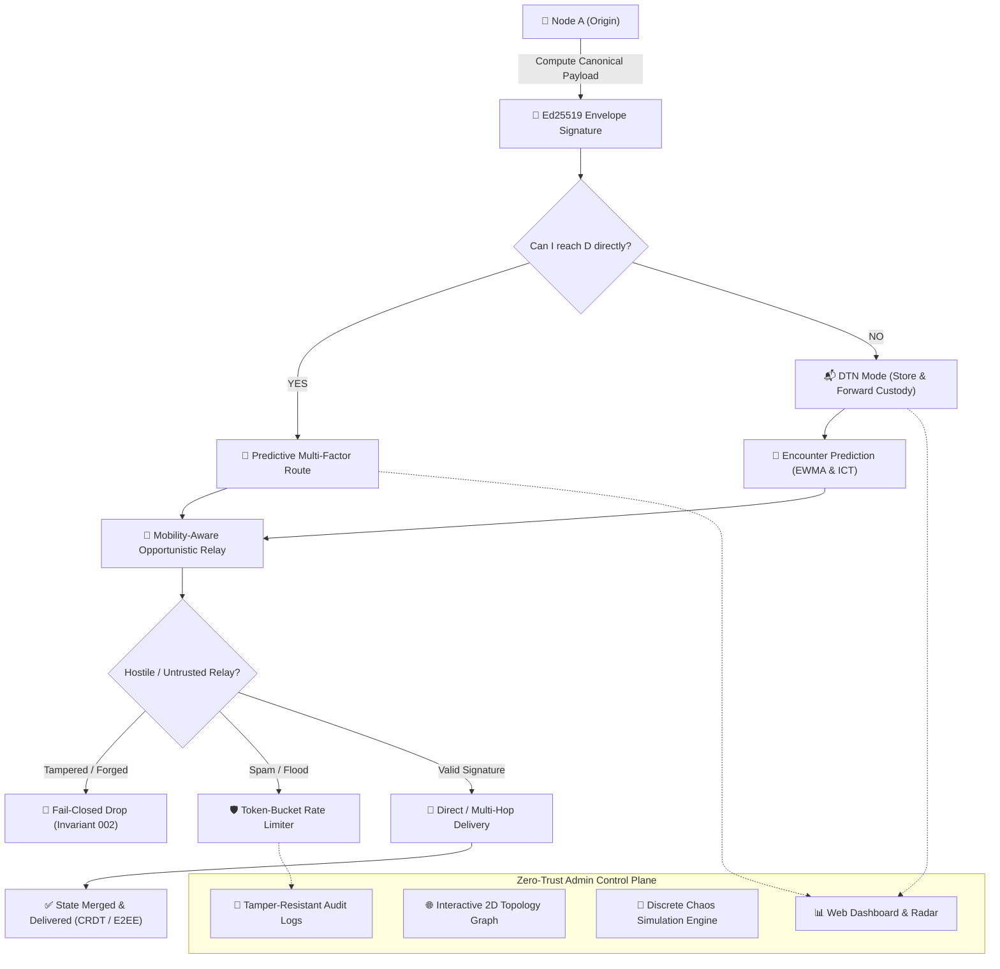

# 🛰️ Whisp — High-Assurance Zero-Trust Distributed Mesh Platform & Admin Control Plane

[-white?style=for-the-badge&logo=android)](https://github.com/vsr-yashwanth/Whisp/releases)

[-white?style=for-the-badge&logo=git)](https://github.com/vsr-yashwanth/Whisp/tree/v4)

**Whisp** is a zero-trust, delay-tolerant, decentralized mesh networking platform engineered for mission-critical peer-to-peer communication, state replication, and distributed apps operating across intermittently connected devices without cellular networks, ISPs, or central servers.

[📥 Download APK](#-direct-apk-installation-recommended) • [Source Code (v4 Branch)](https://github.com/vsr-yashwanth/Whisp/tree/v4) • [Admin Control Plane](#-web-based-admin-control-plane) • [Security & Invariants](#-zero-trust-security-invariants)

---

## ⚡ Conceptual Workflow

---

## 📲 Direct APK Installation *(Recommended)*

You can install Whisp directly on any physical Android phone without needing Android Studio or a computer:

1. On your Android phone, open:  
   👉 **[https://github.com/vsr-yashwanth/Whisp/releases](https://github.com/vsr-yashwanth/Whisp/releases)**
2. Tap on the latest release and download **`app-debug.apk`**.
3. Tap **Open** / **Install** *(if prompted by Android, tap "Allow installation from unknown sources")*.
4. Launch **Whisp**, grant permissions, and communicate securely off-grid!

---

## 🌐 Web-Based Admin Control Plane

The **Whisp Admin Control Plane** provides network operators, administrators, and security researchers with real-time operational control without compromising the Zero-Trust privacy guarantee:

- **📊 Network Overview & Health Score**: Multi-factor scoring (0–100) calculated live from availability, DTN quota, and partition health.
- **🌐 Interactive 2D Topology Graph**: Full HTML5 canvas mesh visualizer with real-time radar sweep and node inspection.
- **📱 Node Management & Quarantine**: Isolate suspicious nodes from routing and relaying with mandatory audit reason tracking.
- **🧭 Routing Intelligence & Explainability**: Inspect active multi-hop routing paths, EWMA stability scores, and algorithmic decision rationales.
- **📬 DTN Storage & Custody Monitor**: Live 500 MB quota tracking, stored bundle details, and replication metrics.
- **🧩 Network Partition Split & Healing**: Monotonic epoch counter with automatic split detection and reconciliation monitoring.
- **📝 CRDT State Monitor**: Last-Write-Wins map synchronization tracking across collaborative offline documents.
- **🛡️ Security Center & Threat Timeline**: Live rate-limiting metrics and cryptographic security events.
- **🧪 Chaos Simulation & Benchmark Lab**: In-browser execution of discrete mesh scenarios (`Scenario A–E`) with reproducible random seeds.
- **📜 Tamper-Resistant Audit Logs**: Complete chronological record of administrative actions.

---

## 🛡️ Zero-Trust Security Invariants

| Invariant | Security Guarantee |
| :--- | :--- |
| **`INVARIANT-001`** | A relay node must never be able to decrypt a 1-to-1 message intended for another recipient. |
| **`INVARIANT-002`** | A forged or tampered packet must be rejected before processing. |
| **`INVARIANT-003`** | A previously processed packet cannot be replayed after its deduplication window. |
| **`INVARIANT-004`** | Expired packets (TTL $\le 0$) must be dropped immediately. |
| **`INVARIANT-005`** | Malformed or fuzzed packets must never crash the application or cause memory leaks. |
| **`INVARIANT-006`** | Private identity keys must remain in hardware Keystore and never be exported. |
| **`INVARIANT-007`** | Compromise of an ephemeral session key must not expose past message history. |
| **`INVARIANT-008`** | An unauthenticated node cannot impersonate another node's cryptographic identity. |
| **`INVARIANT-009`** | Routing headers cannot silently alter authenticated payloads. |
| **`INVARIANT-010`** | Delivery acknowledgments must be cryptographically signed by the final recipient. |
| **`INVARIANT-011`** | Storage quotas (500 MB) cannot be exceeded via packet flooding. |
| **`INVARIANT-012`** | Deleting local conversations must leave zero accessible plaintext copies. |
| **`INVARIANT-013`** | A compromised peer must not compromise unrelated network components. |
| **`INVARIANT-014`** | Security-critical operations must fail closed. |
| **`INVARIANT-015`** | Experimental features cannot weaken the security of normal messaging. |

---

## 📦 Branches

- **[`main` Branch](https://github.com/vsr-yashwanth/Whisp/tree/main)**: Documentation & APK releases.
- **[`v4` Branch (Latest Security & Admin Platform)](https://github.com/vsr-yashwanth/Whisp/tree/v4)**: Complete Whisp Security V4 & Admin Control Plane Platform.
- **[`v3` Branch](https://github.com/vsr-yashwanth/Whisp/tree/v3)**: Whisp V3 Delay-Tolerant Mesh codebase.
- **[`v2` Branch](https://github.com/vsr-yashwanth/Whisp/tree/v2)**: Whisp V2 Adaptive Mesh codebase.
- **[`V1` Branch](https://github.com/vsr-yashwanth/Whisp/tree/V1)**: Original Whisp V1 codebase.

---

## 📄 License & Attribution

Developed by **[vsr-yashwanth](https://github.com/vsr-yashwanth)**.  
Built for resilient, decentralized communication anywhere on Earth.
