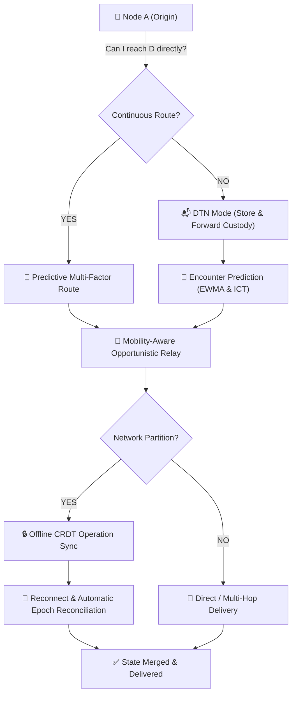

# 🛰️ Whisp — Intelligent Delay-Tolerant Distributed Mesh Platform

<div align="center">

[-white?style=for-the-badge&logo=android)](https://github.com/vsr-yashwanth/Whisp/releases)
[](https://www.android.com)
[](https://kotlinlang.org)
[](https://developer.android.com/jetpack/compose)
[](https://github.com/google/tink)
[-white?style=for-the-badge&logo=git)](https://github.com/vsr-yashwanth/Whisp/tree/v3)

**Whisp** is a programmable, intelligent, delay-tolerant decentralized networking platform engineered for mission-critical peer-to-peer communication, state replication, and distributed apps operating across intermittently connected devices without cellular networks, ISPs, or central servers.

[📥 Download APK](#-direct-apk-installation-recommended) • [Source Code (v3 Branch)](https://github.com/vsr-yashwanth/Whisp/tree/v3) • [v2 Branch](https://github.com/vsr-yashwanth/Whisp/tree/v2) • [v1 Branch](https://github.com/vsr-yashwanth/Whisp/tree/V1) • [Features](#-v3-capabilities) • [Architecture](#-v3-system-architecture)

</div>

---

## ⚡ Conceptual Workflow



---

## 📲 Direct APK Installation *(Recommended)*

You can install Whisp directly on any physical Android phone without needing Android Studio or a computer:

1. On your Android phone, open:  
   👉 **[https://github.com/vsr-yashwanth/Whisp/releases](https://github.com/vsr-yashwanth/Whisp/releases)**
2. Tap on the latest release and download **`app-debug.apk`**.
3. Tap **Open** / **Install** *(if prompted by Android, tap "Allow installation from unknown sources")*.
4. Launch **Whisp**, grant permissions, and you are ready to communicate off-grid!

---

## 🚀 Key V3 Capabilities

### 1. 📬 Delay-Tolerant Networking (DTN) Custody
- **Bundle Lifecycle Management**: Complete custody tracking (`RECEIVED` $\rightarrow$ `STORED` $\rightarrow$ `FORWARDING` $\rightarrow$ `DELIVERED`).
- **Bounded Storage Quotas & Eviction**: Configurable DTN quota (500 MB) with multi-factor eviction (priority, TTL, delivery probability, replication count).
- **Compact Inventory Exchange**: Compact SHA-256 bundle inventory exchange between newly discovered peers.

### 2. 🔮 Predictive Link Stability & Explainability
- **EWMA Historical Tracking**: Real-time forecasting of peer link quality, packet loss, latency variance, and disconnect frequency.
- **Route Explainability**: Generates plain-language reasoning for why specific paths are chosen or penalized in Developer Mode.

### 3. 🏃 Mobility-Aware Opportunistic Routing
- **Sensor-Driven Movement Classification**: Derives coarse movement states (`STATIONARY`, `WALKING`, `RUNNING`, `VEHICLE`) with zero battery-draining continuous GPS polling.
- **Anonymous Encounter Tracking**: Records Inter-Contact Times (ICT) to predict future opportunistic delivery probability.

### 4. 🧩 Network Partition Detection & Epoch Healing
- **Split Detection**: Detects sudden network graph splits and isolates local partition state.
- **Monotonic Network Epochs**: Synchronizes network state summaries and reconciles buffered queues upon partition healing.

### 5. 📝 Distributed CRDT State Collaboration
- **Conflict-Free Replicated Data Types (LWW-Map CRDT)**: Enables real-time offline collaboration on shared notes, event checklists, and status boards without a central server.
- **Deterministic Conflict Resolution**: Lamport logical clocks with actor ID tie-breakers prevent data loss during offline edits.

### 6. 🧪 Discrete Network Simulation & Chaos Engine
- **In-Memory Simulator**: Simulates 50–100 node mesh topologies with programmable packet loss, latency spikes, and partitioned components.
- **Reproducible Chaos Testing**: Fixed seeds (`Random(seed)`) enable exact benchmark reproducibility and automated resilience metrics.

### 7. 🔌 Whisp Developer SDK
- **Decoupled Architecture**: Clean public API (`WhispCore`, `WhispClient`, typed event bus for `PeerDiscovered`, `RouteChanged`, `PartitionDetected`).
- **Headless Sensor Demo**: Sample telemetry client demonstrating mesh broadcasting independent of the chat UI.

---

## 🏛️ V3 System Architecture

```
┌────────────────────────────────────────────────────────┐
│                   Whisp V3 Architecture                │
├────────────────────────────────────────────────────────┤
│  [ Applications & Distributed State ]                  │
│  - Whisp Encrypted Chat                                │
│  - CRDT Collaborative Documents & Checklists           │
│  - Headless Telemetry Sensor Clients                   │
├────────────────────────────────────────────────────────┤
│  [ Whisp Developer SDK Layer ]                         │
│  - WhispClient Facade & Typed Event Bus                │
├────────────────────────────────────────────────────────┤
│  [ Intelligent Network & Routing Core ]                │
│  - PredictionEngine (EWMA Stability & Explainability)  │
│  - MobilityClassifier & Anonymous Encounter Tracker    │
│  - PartitionManager (Topology Epochs & Reconciliation) │
│  - DtnEngine (Bundle Custody & Storage Quotas)         │
│  - CrdtEngine (Conflict-Free Replicated State Sync)    │
│  - PriorityPacketQueue (Preemptive SOS + Fair Sharing) │
│  - DeduplicationCache (Bounded LRU / TTL Filter)       │
├────────────────────────────────────────────────────────┤
│  [ Security & Cryptography Layer ]                     │
│  - Android Keystore Hardware AEAD (At-Rest Storage)    │
│  - Google Tink ECIES / AES-256-GCM (In-Transit Wire)   │
├────────────────────────────────────────────────────────┤
│  [ Hybrid Transport Layer ]                            │
│  - NearbyConnectionsTransport (BLE + Wi-Fi Direct)     │
│  - GlobalRelayManager (Duplex Streaming & Reconnect)   │
│  - Local Subnet UDP Broadcaster (Port 8888)            │
│  - Discrete Simulated Network & Chaos Engine           │
└────────────────────────────────────────────────────────┘
```

---

## 📦 Branches

- **[`main` Branch](https://github.com/vsr-yashwanth/Whisp/tree/main)**: Landing documentation & APK releases.
- **[`v3` Branch (Latest Platform)](https://github.com/vsr-yashwanth/Whisp/tree/v3)**: Complete Whisp V3 Delay-Tolerant Platform.
- **[`v2` Branch](https://github.com/vsr-yashwanth/Whisp/tree/v2)**: Whisp V2 Adaptive Mesh codebase.
- **[`V1` Branch](https://github.com/vsr-yashwanth/Whisp/tree/V1)**: Original Whisp V1 codebase.

---

## 📄 License & Attribution

Developed by **[vsr-yashwanth](https://github.com/vsr-yashwanth)**.  
Built for resilient, decentralized communication anywhere on Earth.
