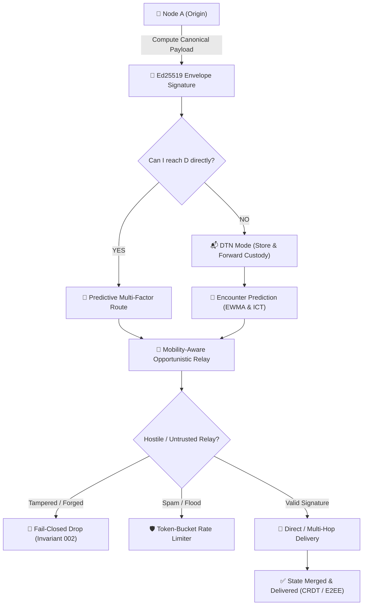

# 🛰️ Whisp — High-Assurance Zero-Trust Distributed Mesh Platform

[-white?style=for-the-badge&logo=android)](https://github.com/vsr-yashwanth/Whisp/releases)

[-white?style=for-the-badge&logo=git)](https://github.com/vsr-yashwanth/Whisp/tree/v4)

**Whisp** is a zero-trust, delay-tolerant, decentralized networking platform engineered for mission-critical peer-to-peer communication, state replication, and distributed apps operating across intermittently connected devices without cellular networks, ISPs, or central servers.

[📥 Download APK](#-direct-apk-installation-recommended) • [Source Code (v4 Branch)](https://github.com/vsr-yashwanth/Whisp/tree/v4) • [v3 Branch](https://github.com/vsr-yashwanth/Whisp/tree/v3) • [v2 Branch](https://github.com/vsr-yashwanth/Whisp/tree/v2) • [v1 Branch](https://github.com/vsr-yashwanth/Whisp/tree/V1) • [Security & Invariants](#-zero-trust-security-invariants)

---

## ⚡ Conceptual Workflow

---

## 📲 Direct APK Installation *(Recommended)*

You can install Whisp directly on any physical Android phone without needing Android Studio or a computer:

1. On your Android phone, open:  
   👉 **[https://github.com/vsr-yashwanth/Whisp/releases](https://github.com/vsr-yashwanth/Whisp/releases)**
2. Tap on the latest release and download **`app-debug.apk`**.
3. Tap **Open** / **Install** *(if prompted by Android, tap "Allow installation from unknown sources")*.
4. Launch **Whisp**, grant permissions, and communicate securely off-grid!

---

## 🛡️ Zero-Trust Security Invariants (V4)

Whisp enforces 15 machine-testable security invariants:

| Invariant | Security Guarantee |
| :--- | :--- |
| **`INVARIANT-001`** | A relay node must never be able to decrypt a 1-to-1 message intended for another recipient. |
| **`INVARIANT-002`** | A forged or tampered packet must be rejected before processing. |
| **`INVARIANT-003`** | A previously processed packet cannot be replayed after its deduplication window. |
| **`INVARIANT-004`** | Expired packets (TTL $\le 0$) must be dropped immediately. |
| **`INVARIANT-005`** | Malformed or fuzzed packets must never crash the application or cause memory leaks. |
| **`INVARIANT-006`** | Private identity keys must remain in hardware Keystore and never be exported. |
| **`INVARIANT-007`** | Compromise of an ephemeral session key must not expose past message history. |
| **`INVARIANT-008`** | An unauthenticated node cannot impersonate another node's cryptographic identity. |
| **`INVARIANT-009`** | Routing headers cannot silently alter authenticated payloads. |
| **`INVARIANT-010`** | Delivery acknowledgments must be cryptographically signed by the final recipient. |
| **`INVARIANT-011`** | Storage quotas (500 MB) cannot be exceeded via packet flooding. |
| **`INVARIANT-012`** | Deleting local conversations must leave zero accessible plaintext copies. |
| **`INVARIANT-013`** | A compromised peer must not compromise unrelated network components. |
| **`INVARIANT-014`** | Security-critical operations must fail closed. |
| **`INVARIANT-015`** | Experimental features cannot weaken the security of normal messaging. |

---

## 🚀 Key V4 Platform Capabilities

1. **Ed25519 Packet Envelope Signatures**: Cryptographic non-repudiation and tampering defense on every mesh packet.
2. **Anti-Flooding Token-Bucket Defense**: Per-peer rate limiting (15 packets/sec max, 30 burst) prevents DoS.
3. **Delay-Tolerant Networking (DTN)**: 500 MB bounded storage with multi-factor custody eviction.
4. **Predictive Routing & Route Explainability**: Real-time EWMA link stability forecasting.
5. **Mobility-Aware Routing**: Accelerometer movement classification (`STATIONARY`, `WALKING`, `RUNNING`, `VEHICLE`).
6. **Network Partition Detection & Epoch Healing**: Monotonic epochs with automatic state sync.
7. **Offline CRDT Collaboration**: Shared collaborative checklists and notes with deterministic Last-Write-Wins merging.
8. **Malicious Node Simulation & 10,000-Input Protocol Fuzzer**: Property-based security testing in CI/CD.

---

## 📦 Branches

- **[`main` Branch](https://github.com/vsr-yashwanth/Whisp/tree/main)**: Documentation & APK releases.
- **[`v4` Branch (Latest Security Platform)](https://github.com/vsr-yashwanth/Whisp/tree/v4)**: Complete Whisp Security V4 Platform.
- **[`v3` Branch](https://github.com/vsr-yashwanth/Whisp/tree/v3)**: Whisp V3 Delay-Tolerant Mesh codebase.
- **[`v2` Branch](https://github.com/vsr-yashwanth/Whisp/tree/v2)**: Whisp V2 Adaptive Mesh codebase.
- **[`V1` Branch](https://github.com/vsr-yashwanth/Whisp/tree/V1)**: Original Whisp V1 codebase.

---

## 📄 License & Attribution

Developed by **[vsr-yashwanth](https://github.com/vsr-yashwanth)**.  
Built for resilient, decentralized communication anywhere on Earth.
