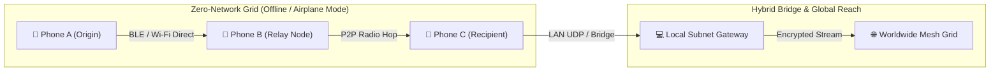

# 🛰️ Whisp — Decentralized Hybrid Mesh & Zero-Network Communication Grid

<div align="center">

[-white?style=for-the-badge&logo=android)](https://github.com/vsr-yashwanth/Whisp/releases)
[](https://www.android.com)
[](https://kotlinlang.org)
[](https://developer.android.com/jetpack/compose)
[](https://github.com/google/tink)
[-white?style=for-the-badge&logo=git)](https://github.com/vsr-yashwanth/Whisp/tree/v2)

**Whisp** is a zero-network, decentralized, multi-hop mesh communication protocol engineered for resilient peer-to-peer messaging without cellular networks, ISPs, central servers, or internet infrastructure.

[📥 Download APK](#-direct-apk-installation-recommended) • [Source Code (v2 Branch)](https://github.com/vsr-yashwanth/Whisp/tree/v2) • [Legacy v1 Branch](https://github.com/vsr-yashwanth/Whisp/tree/V1) • [Features](#-key-capabilities) • [Architecture](#-system-architecture) • [Security](#-cryptographic-architecture)

</div>

---

## ⚡ Overview

In natural disasters, network outages, remote expeditions, or surveillance-heavy environments, standard messaging applications fail. 

**Whisp** transforms everyday Android devices into self-forming, self-healing mesh relay nodes. Messages leap across physical device antennas using high-speed **Bluetooth Low Energy (BLE)** and **Wi-Fi Direct**, route through **local subnet relays**, and bridge across **global decentralized cloud streams** when internet is available—all with end-to-end cryptographic verification and zero-knowledge privacy.



---

## 📲 Direct APK Installation *(Recommended)*

You can install Whisp directly on any physical Android phone without needing Android Studio or a computer:

1. On your Android phone, open:  
   👉 **[https://github.com/vsr-yashwanth/Whisp/releases](https://github.com/vsr-yashwanth/Whisp/releases)**
2. Tap on the latest release and download **`app-debug.apk`**.
3. Tap **Open** / **Install** *(if prompted by Android, tap "Allow installation from unknown sources")*.
4. Launch **Whisp**, grant the local radio permissions, and you are ready to communicate off-grid!

---

## 🚀 Key Capabilities (Whisp V2)

### 1. 🧭 Intelligent Multi-Factor Routing Engine
- Dynamic route scoring evaluating hop count, real RTT latency, packet loss, transport stability, and relay battery state.
- **Self-Healing**: Automatically detects dead links and recalculates alternate routes in real time.

### 2. 📬 Store-and-Forward Offline Buffering
- Intermediate nodes securely buffer transit-encrypted packets in SQLite (`buffered_packets`) when recipients are unreachable.
- Automatically flushes and delivers queued messages the moment peers reconnect or enter proximity.

### 3. 🛡️ Bounded Deduplication Cache
- High-performance thread-safe $O(1)$ LRU filter with TTL expiration preventing broadcast storm flooding across mesh loops.

### 4. 🔋 Battery-Aware Relay Throttling
- Nodes broadcast battery % and charging state in hop breadcrumbs.
- Automatic relay throttling below configurable thresholds (e.g. $<20\%$) to preserve dying relay devices, while **always exempting emergency SOS packets**.

### 5. 🚨 Preemptive SOS Emergency Mode
- Priority-aware network queue: `SOS` (100), `IMPORTANT` (50), `NORMAL` (10), `FILE` (5) with starvation prevention.
- Dedicated high-visibility SOS broadcast trigger in the chat input bar.

### 6. 🔐 Dual-Layer Hardware Cryptography
- **At Rest (Local Storage)**: Encrypted using Google Tink and the hardware-backed **Android Keystore (AES-256-GCM AEAD)**.
- **In Transit (Over the Wire)**: **Zero-Knowledge AEAD transit encryption**. Relays can forward packets without inspecting contents.

### 7. 🗺️ Cryptographic Packet Hop Traceability
Every routed packet carries a verifiable digital breadcrumb trail that records node IDs, transport protocols, and microsecond latencies across each hop.

### 8. 🎛️ Embedded Web Node Console & Radar Dashboard
Internal **Ktor HTTP web server** (`http://<device-ip>:8080`) hosting a 30 FPS animated 2D Canvas Radar visualizer, MongoDB-style document explorer, and live telemetry audit trails.

---

## 🏛️ System Architecture

```
┌────────────────────────────────────────────────────────┐
│                   Whisp Architecture                   │
├────────────────────────────────────────────────────────┤
│  [ UI Layer ]                                          │
│  - Jetpack Compose Obsidian Theme                      │
│  - Real-Time Mesh Radar Visualizer (Canvas 30 FPS)      │
│  - Interactive Cryptographic Route Inspector Dialog   │
├────────────────────────────────────────────────────────┤
│  [ Application & State Engine ]                        │
│  - ChatViewModel (StateFlow & Coroutines)              │
│  - Global Ingestion Pipeline (OfflineChatApp)          │
│  - SQLite Room Database (Messages & BufferedPackets)   │
├────────────────────────────────────────────────────────┤
│  [ Routing & Relay Engine ]                            │
│  - RoutingEngine (Multi-Factor Scoring & Self-Healing) │
│  - StoreAndForwardManager (Offline Buffer & Auto-Flush)│
│  - BatteryRelayPolicy (Dynamic Power Throttling)       │
│  - PriorityPacketQueue (Preemptive SOS Dispatching)    │
│  - DeduplicationCache (Bounded LRU & TTL Filter)       │
├────────────────────────────────────────────────────────┤
│  [ Security & Cryptography Layer ]                     │
│  - Android Keystore Hardware AEAD (At-Rest Storage)    │
│  - Google Tink ECIES / AES-256-GCM (In-Transit Wire)   │
├────────────────────────────────────────────────────────┤
│  [ Hybrid Mesh Transport Layer ]                       │
│  - NearbyConnectionsTransport (BLE + Wi-Fi Direct)     │
│  - GlobalRelayManager (Duplex Streaming & Reconnect)   │
│  - Local Subnet UDP Broadcaster (Port 8888)            │
│  - Embedded Ktor Web Node Server (Port 8080/8081)      │
└────────────────────────────────────────────────────────┘
```

---

## 📦 Branches & Project Structure

- **[`main` Branch](https://github.com/vsr-yashwanth/Whisp/tree/main)**: Clean landing documentation and architecture guide.
- **[`v2` Branch (Current Active)](https://github.com/vsr-yashwanth/Whisp/tree/v2)**: Whisp V2 with Adaptive Routing, Store-and-Forward, Battery-Aware Relay, and SOS Queue.
- **[`V1` Branch (Legacy)](https://github.com/vsr-yashwanth/Whisp/tree/V1)**: Original Whisp V1 implementation.

```
Whisp/ (Branch: v2)
├── .github/workflows/
│   └── build-apk.yml               # Automated GitHub Actions APK builder
├── OfflineChat/
│   ├── app/src/main/
│   │   ├── java/com/example/offlinechat/
│   │   │   ├── data/
│   │   │   │   ├── ChatDao.kt      # SQLite Room DAO with BufferedPacket queries
│   │   │   │   ├── ChatDatabase.kt # Room Database v3 with auto migration
│   │   │   │   └── Entities.kt     # Message, Conversation & BufferedPacket
│   │   │   ├── network/
│   │   │   │   ├── DeduplicationCache.kt         # Bounded LRU/TTL deduplication
│   │   │   │   ├── GlobalRelayManager.kt         # Cloud stream & UDP broadcast
│   │   │   │   ├── HopRecord.kt                  # Packet breadcrumb data model
│   │   │   │   ├── HybridMeshTransport.kt        # Multi-transport mesh orchestrator
│   │   │   │   ├── MeshPacket.kt                 # Versioned protocol data model
│   │   │   │   ├── NearbyConnectionsTransport.kt # BLE & Wi-Fi Direct radio driver
│   │   │   │   ├── PeerTransport.kt              # Core transport interface
│   │   │   │   ├── PriorityPacketQueue.kt        # Preemptive SOS/Priority queue
│   │   │   │   ├── StoreAndForwardManager.kt     # Offline store-and-forward engine
│   │   │   │   └── WebServerManager.kt           # Embedded Ktor HTTP API server
│   │   │   ├── routing/
│   │   │   │   ├── BatteryRelayPolicy.kt         # Battery-aware relay throttling
│   │   │   │   ├── RouteMetrics.kt               # Route candidate data models
│   │   │   │   └── RoutingEngine.kt              # Intelligent multi-factor scoring
│   │   │   ├── security/
│   │   │   │   └── CryptoManager.kt              # Dual Keystore + Tink AEAD engine
│   │   │   ├── ui/
│   │   │   │   ├── AdminScreen.kt                # Active routes & radar dashboard
│   │   │   │   ├── ChatScreen.kt                 # Chat UI with SOS & Route Inspector
│   │   │   │   ├── HomeScreen.kt                 # Peer list & gateway status
│   │   │   │   └── SettingsScreen.kt             # Battery relay threshold policy
│   │   │   ├── ChatViewModel.kt                  # Coroutine state management
│   │   │   ├── MainActivity.kt                   # Compose Navigation entry
│   │   │   └── OfflineChatApp.kt                 # Global background packet pipeline
│   │   └── assets/web/                           # Embedded Web Admin Console
│   └── build.gradle.kts                          # Dependencies & Gradle config
└── mesh_relay_server.py                          # Local Wi-Fi Subnet bridge daemon
```

---

## 🛠️ Tech Stack & Dependencies

- **Language**: Kotlin 1.9+, Java 17
- **UI Framework**: Android Jetpack Compose, Material 3
- **Local Persistence**: Android Room SQLite Database with Coroutine Flows
- **Cryptography**: Google Tink Cryptography Library + Android Hardware Keystore
- **Proximity Radios**: Google Nearby Connections API (P2P Cluster strategy)
- **Networking**: Ktor Embedded Server (CIO engine), OkHttp 4.12, Java NIO Datagram Sockets
- **Unit Testing**: JUnit 4 with Android unit test options

---

## 🚀 Building from Source

### 1. Clone the Codebase
Switch to the **`v2`** branch to access the latest source code:
```bash
git clone -b v2 https://github.com/vsr-yashwanth/Whisp.git
cd Whisp/OfflineChat
```

### 2. Build and Install via Gradle
Connect your Android device via USB (with USB Debugging enabled) and run:
```bash
./gradlew installDebug
```

---

## 📄 License & Attribution

Developed by **[vsr-yashwanth](https://github.com/vsr-yashwanth)**.  
Built for robust, private, decentralized communication anywhere on Earth.
