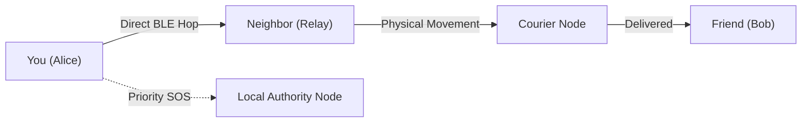

# Whisp — Off-Grid Peer-to-Peer Mesh & SOS Platform

[-emerald?style=for-the-badge&logo=android)](https://github.com/vsr-yashwanth/Whisp/releases)

[-white?style=for-the-badge&logo=git)](https://github.com/vsr-yashwanth/Whisp/tree/v4)

**Whisp** turns standard Android phones into an encrypted, off-grid communication network. When cell towers go down, power outages hit, or you're traveling off the grid, Whisp keeps people connected directly device-to-device using Bluetooth Low Energy and Wi-Fi Direct.

[Get the App](#-quick-install-android) • [What's New](#-core-features) • [Admin Dashboard](#-web-control-plane) • [Security](#-zero-trust-security) • [Source Code](https://github.com/vsr-yashwanth/Whisp/tree/v4)

---

## Why Whisp?

In natural disasters, remote hikes, or network blackouts, conventional messaging apps stop working the second you lose internet connectivity. 

Whisp creates a **living peer-to-peer mesh**:
- **No Internet Required**: Messages hop autonomously through intermediate phones to reach the recipient.
- **Store & Forward (DTN)**: If a recipient is offline or out of range, nearby devices carry the encrypted packet until they cross paths.
- **Zero-Trust & Private**: Everything is end-to-end encrypted with hardware Keystore keys. Intermediate relay nodes can never read your messages.

---

## Core Features

### Unique Decentralized Blockchain IDs
Every user gets a permanent cryptographic address (`0x...`). Messages are tagged to this blockchain ID so delay-tolerant nodes can hold and route packets specifically to you, even if your phone was completely offline when the message was sent.

###  1-on-1 Friends & Direct Private Chats
Search for friends by their username or paste their `0x...` Blockchain ID. Add them to your personal directory and chat privately in isolated, end-to-end encrypted rooms with real-time hop tracing.

###  Emergency Authorities SOS Channel
A dedicated, high-priority emergency channel (`Priority 100`) designed for critical moments.
- Instant 1-tap broadcast presets: **Medical Emergency**, **Fire / Hazard**, and **Search & Rescue**.
- **Battery-Bypass Guarantee**: Emergency SOS broadcasts are never dropped by battery conservation policies, ensuring alerts reach first-responders and local stations.

###  Dynamic User Accounts & Protected Admin Gate
- Create accounts and sign in with your own custom credentials.
- Zero-trust Admin Gate: Network controls and metrics require an Administrator Master Key to prevent unauthorized access.

###  Offline Collaborative Notes (CRDT)
Share and update checklists and survival plans with nearby peers without internet using conflict-free replicated data types.

---

##  Quick Install (Android)

You don't need Android Studio or a computer to use Whisp:

1. Open **[Whisp Releases](https://github.com/vsr-yashwanth/Whisp/releases)** on your Android phone.
2. Download **`app-debug.apk`** from the latest release.
3. Tap **Install** *(enable "Install unknown apps" if prompted)*.
4. Launch **Whisp**, tap **CREATE ACCOUNT**, and you're ready to communicate off-grid!

---

##  Web Control Plane & Mesh Radar

Whisp includes a lightweight browser-based control dashboard for network administrators and emergency coordinators:

- **2D Mesh Radar**: Real-time canvas visualization of nearby peers, active radio hops, and signal paths.
- **Network Health Score**: Instant calculation of mesh connectivity, DTN custody storage, and partition health.
- **User Directory & Account Controls**: Inspect active accounts, toggle user access, and review audit logs.
- **Chaos Lab**: Run simulated mesh network benchmarks to verify multi-hop reliability under stress.

---

##  Zero-Trust Security

| Principle | How Whisp Enforces It |
| :--- | :--- |
| **End-to-End Privacy** | Relay nodes only carry encrypted ciphertexts (`AES-256-GCM`). Relays cannot read your payload. |
| **Tamper Resistance** | Every packet is sealed with an `Ed25519` cryptographic signature. Modified packets are discarded immediately. |
| **Anti-Spam & Flooding** | Token-bucket rate limiters prevent rogue nodes from congesting radio channels. |
| **Hardware Key Storage** | Identity keys are kept in the Android hardware Keystore and never leave your device. |

---

##  Repository Branches

- **[`main`](https://github.com/vsr-yashwanth/Whisp/tree/main)**: Project documentation and official release hub.
- **[`v4`](https://github.com/vsr-yashwanth/Whisp/tree/v4)** *(Active)*: Latest release with Blockchain IDs, 1-on-1 Friends Chat, Emergency SOS Channel, and Web Control Plane.
- **[`v3`](https://github.com/vsr-yashwanth/Whisp/tree/v3)**: Delay-Tolerant Networking (DTN) and predictive routing core.
- **[`v2`](https://github.com/vsr-yashwanth/Whisp/tree/v2)**: Adaptive mesh networking foundation.

---

Crafted with ❤️ by **[vsr-yashwanth](https://github.com/vsr-yashwanth)**  
*Keeping people connected when it matters most.*

