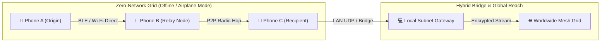

# 🛰️ Whisp — Decentralized Hybrid Mesh & Zero-Network Communication Grid

<div align="center">

[](https://www.android.com)
[](https://kotlinlang.org)
[](https://developer.android.com/jetpack/compose)
[](https://github.com/google/tink)
[](https://github.com/vsr-yashwanth/Whisp/tree/V1)

**Whisp** is a zero-network, decentralized, multi-hop mesh communication protocol engineered for resilient peer-to-peer messaging without cellular networks, ISPs, central servers, or internet infrastructure.

[Source Code (V1 Branch)](https://github.com/vsr-yashwanth/Whisp/tree/V1) • [Features](#-key-capabilities) • [Architecture](#-system-architecture) • [Security](#-cryptographic-architecture) • [Getting Started](#-getting-started)

</div>

---

## ⚡ Overview

In natural disasters, network outages, remote expeditions, or surveillance-heavy environments, standard messaging applications fail. 

**Whisp** transforms everyday Android devices into self-forming, self-healing mesh relay nodes. Messages leap across physical device antennas using high-speed **Bluetooth Low Energy (BLE)** and **Wi-Fi Direct**, route through **local subnet relays**, and bridge across **global decentralized cloud streams** when internet is available—all with end-to-end cryptographic verification and zero-knowledge privacy.



---

## 🚀 Key Capabilities

### 1. 📡 Multi-Layer Hybrid Mesh Transport
- **Zero-Network Antenna-to-Antenna Radio**: Direct device-to-device communication using Google Nearby Connections API over BLE and Wi-Fi Direct. Functions in full Airplane Mode without cell towers or SIM cards.
- **Local Subnet & UDP Multicast Relay**: Automatic zero-cable discovery across local Wi-Fi networks via UDP broadcast (`255.255.255.255:8888`) and HTTP bridge.
- **Global Decentralized Cloud Gateway**: Persistent real-time duplex streaming relay (`ntfy.sh` P2P channel) connecting nodes seamlessly across different continents.

### 2. 🛡️ Dual-Layer Hardware Cryptography
- **At Rest (Local Storage)**: Encrypted using Google Tink and the hardware-backed **Android Keystore (AES-256-GCM AEAD)**. Plaintext is never written unencrypted to disk.
- **In Transit (Over the Wire)**: **Zero-Knowledge AEAD transit encryption**. Intermediate relay nodes and gateways can forward packets along the mesh grid but can never inspect message contents.

### 3. 🗺️ Cryptographic Packet Hop Traceability
Every routed packet carries a verifiable digital breadcrumb trail that records its physical and virtual journey across the grid:
- **Node ID & Device Name**: Identifies routing hardware along the path.
- **Transport Type**: Protocol utilized (`BLE_MESH`, `LOCAL_BRIDGE`, `GLOBAL_RELAY`).
- **Hop Latency & Timestamps**: Microsecond-precision metrics tracking transit delays across hops.
- **Route Inspector UI**: Tap any message bubble in the app to view its interactive visual journey path.

### 4. 🎛️ Embedded Web Node Console & Radar Dashboard
Each Whisp node hosts an internal **Ktor HTTP web server** (`http://<device-ip>:8080`):
- **Live 2D Canvas Radar**: 30 FPS animated radar visualizer sweeping concentric distance rings and plotting connected grid peers in real time.
- **MongoDB-Style Document Explorer**: Real-time JSON database explorer with instant query metrics.
- **Telemetry & Packet Audit Trail**: Live traffic charts, signal metrics, and cryptographic ledger logs.

### 5. 🖤 Obsidian & Titanium Monochrome Aesthetics
- Designed with an ultra-minimalist, high-contrast dark aesthetic inspired by modern industrial UI standards (Nothing OS / Linear / Apple Dark Mode).
- Jetpack Compose interface featuring crisp white sent pills, dark graphite received bubbles with hairline borders, and tactile micro-animations.

---

## 🏛️ System Architecture

```
┌────────────────────────────────────────────────────────┐
│                   Whisp Architecture                   │
├────────────────────────────────────────────────────────┤
│  [ UI Layer ]                                          │
│  - Jetpack Compose Obsidian Theme                      │
│  - Real-Time Mesh Radar Visualizer (Canvas 30 FPS)     │
│  - Interactive Cryptographic Route Inspector Dialog    │
├────────────────────────────────────────────────────────┤
│  [ Application & State Engine ]                        │
│  - ChatViewModel (StateFlow & Coroutines)              │
│  - Global Ingestion Pipeline (OfflineChatApp)          │
│  - SQLite Room Database (Encrypted Messages & Hops)    │
├────────────────────────────────────────────────────────┤
│  [ Security & Cryptography Layer ]                     │
│  - Android Keystore Hardware AEAD (At-Rest Storage)    │
│  - Google Tink ECIES / AES-256-GCM (In-Transit Wire)   │
├────────────────────────────────────────────────────────┤
│  [ Hybrid Mesh Transport Layer ]                       │
│  - NearbyConnectionsTransport (BLE + Wi-Fi Direct)     │
│  - GlobalRelayManager (Duplex Streaming & Reconnect)   │
│  - Local Subnet UDP Broadcaster (Port 8888)            │
│  - Embedded Ktor Web Node Server (Port 8080/8081)      │
└────────────────────────────────────────────────────────┘
```

---

## 📦 Project Structure

All source code and implementation files are maintained on the **[`V1` branch](https://github.com/vsr-yashwanth/Whisp/tree/V1)**:

```
Whisp/ (Branch: V1)
├── .github/workflows/
│   └── build-apk.yml               # Automated GitHub Actions APK builder
├── OfflineChat/
│   ├── app/src/main/
│   │   ├── java/com/example/offlinechat/
│   │   │   ├── data/
│   │   │   │   ├── ChatDao.kt      # SQLite Room DAO for messages & peers
│   │   │   │   ├── ChatDatabase.kt # Room Database with automated migration
│   │   │   │   └── Entities.kt     # Message, Conversation & Hop entities
│   │   │   ├── network/
│   │   │   │   ├── GlobalRelayManager.kt         # Cloud stream & UDP broadcast
│   │   │   │   ├── HopRecord.kt                  # Packet breadcrumb data model
│   │   │   │   ├── HybridMeshTransport.kt        # Multi-transport mesh orchestrator
│   │   │   │   ├── NearbyConnectionsTransport.kt # BLE & Wi-Fi Direct radio driver
│   │   │   │   ├── PeerTransport.kt              # Core transport interface
│   │   │   │   └── WebServerManager.kt           # Embedded Ktor HTTP API server
│   │   │   ├── security/
│   │   │   │   └── CryptoManager.kt              # Dual Keystore + Tink AEAD engine
│   │   │   ├── ui/
│   │   │   │   ├── AdminScreen.kt                # Node telemetry & radar sweep
│   │   │   │   ├── ChatScreen.kt                 # Chat UI with Route Inspector
│   │   │   │   ├── HomeScreen.kt                 # Peer list & gateway status
│   │   │   │   └── theme/                        # Obsidian & Titanium palette
│   │   │   ├── ChatViewModel.kt                  # Coroutine state management
│   │   │   ├── MainActivity.kt                   # Compose Navigation entry
│   │   │   └── OfflineChatApp.kt                 # Global background packet pipeline
│   │   └── assets/web/                           # Embedded Web Admin Console
│   │       ├── index.html                        # Radar dashboard markup
│   │       ├── style.css                         # Obsidian styling
│   │       └── app.js                            # 2D Radar Canvas & API hooks
│   └── build.gradle.kts                          # Dependencies & Gradle config
└── mesh_relay_server.py                          # Local Wi-Fi Subnet bridge daemon
```

---

## 🛠️ Tech Stack & Dependencies

- **Language**: Kotlin 1.9+, Java 17
- **UI Framework**: Android Jetpack Compose, Material 3
- **Local Persistence**: Android Room SQLite Database with Coroutine Flows
- **Cryptography**: Google Tink Cryptography Library + Android Hardware Keystore
- **Proximity Radios**: Google Nearby Connections API (P2P Cluster strategy)
- **Networking**: Ktor Embedded Server (CIO engine), OkHttp 4.12, Java NIO Datagram Sockets
- **Serialization**: Kotlinx Serialization, Google GSON, Android Native JSON

---

## 🚀 Getting Started

### 1. Clone the Codebase
Switch to the **`V1`** branch to access the full source code:
```bash
git clone -b V1 https://github.com/vsr-yashwanth/Whisp.git
cd Whisp/OfflineChat
```

### 2. Build and Install via Gradle
Connect your Android device via USB (with USB Debugging enabled) and run:
```bash
./gradlew installDebug
```

### 3. Permissions Required
Whisp requires zero root access. On first launch, grant the following local radio permissions:
- **Bluetooth & Nearby Devices** (for BLE mesh advertising and scanning)
- **Wi-Fi & Local Network** (for Wi-Fi Direct and local subnet routing)
- **Location** (required by Android OS for Bluetooth LE beacon scanning)

---

## 🔒 Threat & Privacy Model

| Feature | Whisp Implementation | Protection Level |
| :--- | :--- | :--- |
| **Data at Rest** | Android Keystore Hardware AEAD | Immune to physical memory dumps and local extraction |
| **Data in Transit** | Zero-Knowledge AES-256-GCM | Eavesdropping-proof against ISPs, routers, and relay nodes |
| **Metadata & Routing** | Cryptographic Hop Breadcrumbs | Full packet accountability with anti-loopback suppression |
| **Network Autonomy** | Off-Grid BLE / Wi-Fi Direct | Resilient against internet shutdowns and cellular blackouts |

---

## 📄 License & Attribution

Developed by **[vsr-yashwanth](https://github.com/vsr-yashwanth)**.  
Built for robust, private, decentralized communication anywhere on Earth.
