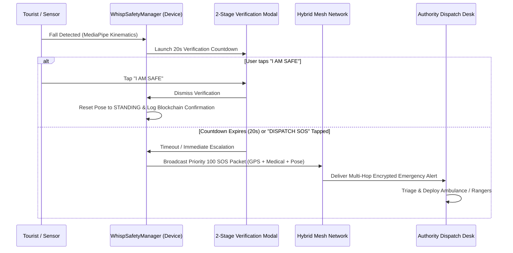
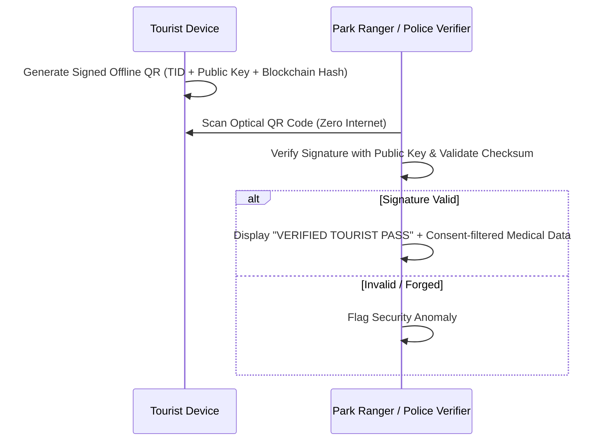

# System Architecture: Whisp Mesh & Tourist Safety Platform

## 1. High-Level Architecture Overview

**Whisp** is built on an **offline-first, zero-trust, multi-transport mesh architecture** designed for high-assurance peer-to-peer communication, delay-tolerant routing, and intelligent tourist safety monitoring in remote, high-risk, or network-constrained travel destinations.

```
+-----------------------------------------------------------------------------------+
|                            PRESENTATION LAYER (JETPACK COMPOSE)                   |
|  +---------------------------+  +--------------------------+  +-----------------+ |
|  | Whisp Tourist Safety UI   |  | Authority Dispatch Desk  |  | Encrypted Chat  | |
|  | - Digital Tourist ID & QR |  | - Incident Triage Feed   |  | - P2P Channels  | |
|  | - Smart Geo-Fence Radar   |  | - Targeted CCTV Search   |  | - Group Mesh    | |
|  | - 33-Pt Pose & AI Risk    |  | - Live Zone Monitor      |  | - CRDT Notes    | |
|  | - 2-Stage SOS Countdown   |  | - 66% Impact Analytics   |  | - Admin Grid    | |
|  +---------------------------+  +--------------------------+  +-----------------+ |
+-----------------------------------------------------------------------------------+
                                         |
                                         v
+-----------------------------------------------------------------------------------+
|                               DOMAIN / SERVICE LAYER                              |
|  +--------------------+  +----------------------+  +----------------------------+ |
|  | WhispSafetyManager |  |   RoutingEngine      |  |     MobilityClassifier     | |
|  | - AI Risk Scoring  |  | - Multi-Hop Paths    |  | - Movement state (walk/   | |
|  | - Geo-Fence Engine |  | - Stability Metric   |  |   run/vehicle/still)       | |
|  | - 33-Pt Pose Sim   |  | - Battery Relay Guard|  | - Encounter history        | |
|  | - Blockchain Chain |  | - Delay-Tolerant DTN |  | - Prediction engine        | |
|  +--------------------+  +----------------------+  +----------------------------+ |
+-----------------------------------------------------------------------------------+
                                         |
                                         v
+-----------------------------------------------------------------------------------+
|                        SECURITY & CRYPTOGRAPHIC LAYER                             |
|  - Google Tink Hardware-Backed AEAD (AES-256-GCM at rest, XChaCha20-Poly1305)     |
|  - Ed25519 Cryptographic Envelope Signatures & Packet Authentication             |
|  - SHA-256 Blockchain Trust Ledger with Proof-of-Integrity Chain Validation       |
|  - Selective Privacy-First Consent Matrix (Medical, Location, Keypoints)          |
+-----------------------------------------------------------------------------------+
                                         |
                                         v
+-----------------------------------------------------------------------------------+
|                              TRANSPORT & RELAY LAYER                              |
|  +--------------------------------+  +------------------------------------------+ |
|  | Local Radios (Zero Internet)   |  | Hybrid Gateways                          | |
|  | - Google Nearby Connections    |  | - Embedded Ktor Local Web Server (:8080) | |
|  | - Bluetooth Low Energy (BLE)   |  | - OkHttp WebSocket Global Gateway Relay  | |
|  | - Wi-Fi Direct Peer-to-Peer    |  | - DTN Store-and-Forward Custody Engine   | |
|  +--------------------------------+  +------------------------------------------+ |
+-----------------------------------------------------------------------------------+
                                         |
                                         v
+-----------------------------------------------------------------------------------+
|                              PERSISTENCE LAYER (ROOM)                             |
|  - Conversations & Messages Database   - Tourist Profiles & Selective Consents    |
|  - Buffered Store-and-Forward Packets  - Geo-Fence Zones (Safe / Caution / Danger)|
|  - DTN Bundles with Custody Tracking   - Active Incidents & Multi-Agency Logs     |
|  - CRDT Operations & Document Store    - Immutable Blockchain Block History       |
+-----------------------------------------------------------------------------------+
```

---

## 2. Core Architectural Subsystems

### 2.1 Whisp Tourist Safety Subsystem (`WhispSafetyManager`)
- **Central Coordinator**: Coordinates tourist profiles, consent state, live coordinates, zone breach triggers, pose classification, risk scores, and SOS incidents.
- **State Management**: Exposes Kotlin `StateFlow` streams for reactive Jetpack Compose UI rendering.
- **Zero-Dependency Core**: All algorithms (Haversine distance, AI risk scoring, 33-point pose landmark kinematics, SHA-256 blockchain verification) execute locally without requiring internet or cloud processing.

### 2.2 Multi-Transport Mesh Subsystem (`HybridMeshTransport`)
- **Transport Abstraction (`PeerTransport`)**: Encapsulates physical radio interfaces so higher-level messaging and safety features operate independently of underlying connection mechanisms.
- **Supported Channels**:
  - **Nearby Connections / Wi-Fi Direct**: High-bandwidth direct device-to-device streaming.
  - **BLE (Bluetooth Low Energy)**: Continuous background discovery and low-energy beacon fallback.
  - **Global Relay Gateway**: Opportunistic cloud relay bridge when internet is available.
- **Deduplication & Loop Prevention**: Maintains a rolling LRU deduplication cache of packet IDs to prevent routing broadcast storms.

### 2.3 Delay-Tolerant Networking (DTN) & Store-and-Forward (`DtnEngine`)
- **Intermittent Connectivity Handling**: When a destination node or emergency responder is out of physical radio range, packets are bundled into DTN custody entities with TTLs, priorities, and replication budgets.
- **Opportunistic Synchronization**: When new peers are encountered, custody bundles are exchanged and routed multi-hop toward available gateway nodes.

### 2.4 Cryptographic Trust & Privacy Layer (`CryptoManager` & Blockchain)
- **At-Rest Encryption**: User messages, private keys, and sensitive medical data are encrypted at rest using Android Keystore-backed keys via Google Tink AEAD.
- **In-Transit Encryption**: Packets are encrypted per hop and authenticated with digital signatures.
- **Blockchain Trust Layer**: Creates tamper-evident SHA-256 chained blocks for:
  - Tourist digital identity registrations
  - Privacy consent grants & revocations
  - Emergency SOS incidents
  - Authority dispatch actions and checkpoint check-ins.

---

## 3. Data Flow Workflows

### 3.1 Two-Stage SOS Emergency Trigger Flow


### 3.2 Offline Tourist QR Verification Flow

